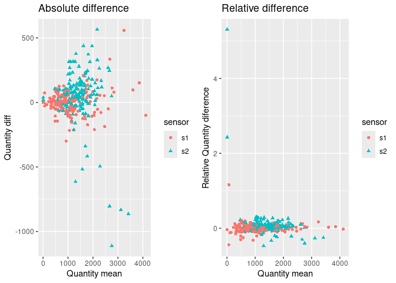

ImgOMIC
================

<p align="center">

</p>
<p align="center">
<strong>ImgOMIC</strong> is an R package designed to analyze medical
imaging phenotypes together with OMIC data (genomics, transcriptomics,
proteomics, etc.). It provides functions for data preprocessing, error
correction, precision analysis, and longitudinal modeling.
</p>

------------------------------------------------------------------------

## Features

- **Measure Precision**: Quantify measurement variability for each
  sensor or particle type, useful for microarrays, qPCR, or proteomics
  assays.
- **Error Propagation**: Compute the uncertainty of derived values using
  sensor-specific measurement errors.
- **Diameter Correction**: Correct aneurysm diameter measurements from
  Ultrasound (US) and CT scans using probabilistic modeling.
- **Monte Carlo Simulation**: Estimate the variability of longitudinal
  measurements per patient to account for unequal reliability.

------------------------------------------------------------------------

## Quick Example

``` r
library(ImgOMIC)

# Simulated patient data
df_test <- read.table("README_data/Tutorial_table.csv", header = TRUE, sep = ",")

# Compute measurement precision
res_precision <- measure_precision(df_test)
```

<!-- -->

``` r
res_precision
```

    ## # A tibble: 2 × 5
    ##   sensor data               RMS       MAD       n_precision
    ##   <fct>  <list>             <list>    <list>    <list>     
    ## 1 s1     <tibble [156 × 4]> <dbl [1]> <dbl [1]> <int [1]>  
    ## 2 s2     <tibble [156 × 4]> <dbl [1]> <dbl [1]> <int [1]>

``` r
# Simulate patient data
df_patient <- data.frame(
  Date = c(2016, 2017, 2018, 2019, 2020),
  Diam = c(30, 35, 32, 36, 39),
  CT   = c(1, 0, 1, 0, 1)
)

# Correct diameters
res_corrected <- correct_diameter_single(df_patient)
res_corrected$curves[[1]]
```

    ## [1] 27.15 29.75 32.00 36.00 39.00

------------------------------------------------------------------------

## Documentation

For detailed explanations, tutorials, and full examples with plots, see
the package **vignette**:

[Full Documentation and Tutorial](vignettes/documentation.md)

------------------------------------------------------------------------

## Installation

``` r
# Install the package from GitHub (if available)
# devtools::install_github("cyber-Ager/ImgOMIC")
library(ImgOMIC)
```

------------------------------------------------------------------------

## License

This package is licensed under GPL-3.0.  
© 2025 Ager Uribezubia / Genomic of Complex Diseases (Sant Pau Research
Intitute)
