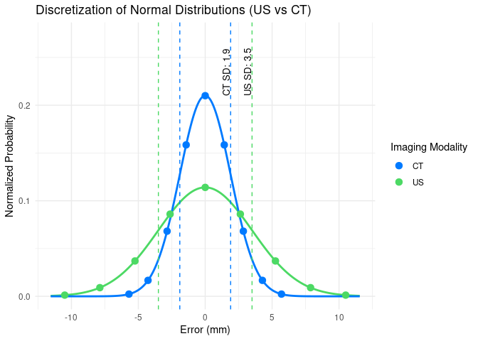
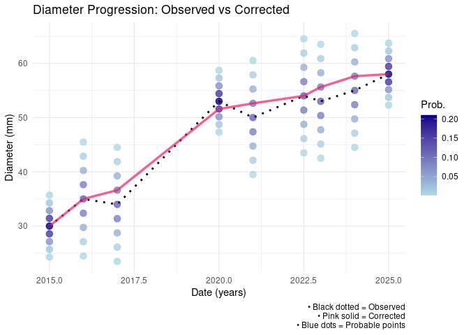
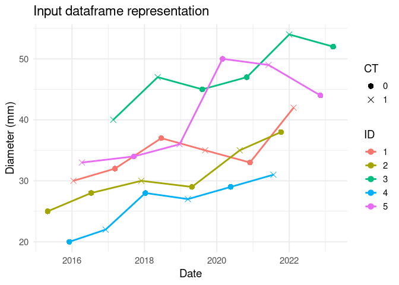
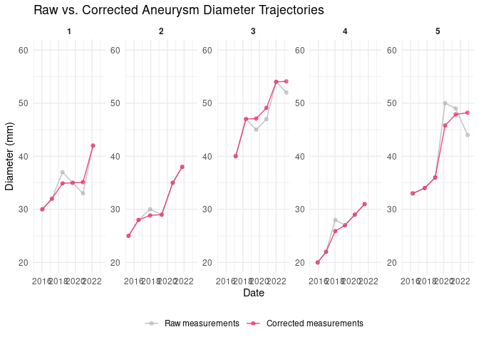
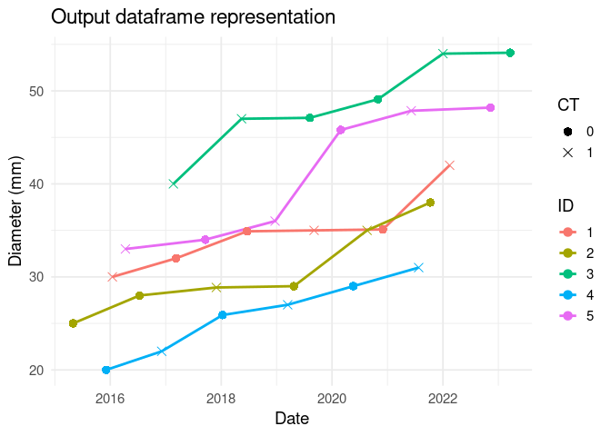

ImgOMIC
================

\[EU\] R-ko pakete hau nire doktoretzako proiektuan erabiliko ditudan
funtzioak gordetzeko sortua da. Proiektu honek irudietatik ateratako
ezaugarriak zientzia omikoekin (genomika, trankriptomika, proteomika
etab.) aztertzea du helburu, hortik ImgOMIC izena.

\[EN\] This package was created to compile the necessary functions for
analyzing medical imaging phenotypes alongside OMIC data. It provides
functions for the complete analysis workflow, from data preprocessing to
building associative models.

## Precision Calculation

In most cases, when working with microarrays for the quantification of
miRNA, RNA, or protein presence, duplicates are used. These duplicates
help reduce measurement variability by averaging the two results.
Additionally, they allow for quantifying variability and determining the
precision of the measuring equipment. Measuring precision is crucial to
understanding the variability of measurements, ensuring that the
associations we identify are robust and reliable.

### Measure precision

This function is based on the 2009 article [*“Estimating Precision Using
Duplicate Measurements”* by **Nicole Pauly Hyslop and Warren H.
White**](https://www.tandfonline.com/doi/abs/10.3155/1047-3289.59.9.1032).

The function’s goal is to quantify the precision of each “sensor” used
to detect the presence of a given particle. For instance, in miRNA
detection using qPCR in a microarray, the “sensor” corresponds to the
different miRNAs. Even if the same sample is introduced into every well,
each well emits fluorescent light based on the presence of a specific
miRNA, as the “sensor mechanisms” (e.g., stem-loop primers) differ for
each miRNA. The measurement variability for each miRNA can differ, but
this variability is assessable using duplicates.

The `measure_precision` function computes precision using the Root Mean
Square (RMS) and Mean Absolute Difference (MAD). The equations used are
as follows:

$$
D_1 = \frac{(C_{i1}-C_{i2})/\sqrt{2}}{\bar{C_{i}}}
$$

$$
\text{RMS Precision} = \sqrt{\frac{1}{n}\sum_{i = 1}^{n}D_i^2}\times100\%
$$

$$
\text{MAD Precision} = \sqrt{\frac{\pi}{2}}\frac{1}{n}\sum_{i = 1}^{n}|D_i|\times100\%
$$

The function calculates precision as relative values because, in most
microarray or similar techniques, the absolute error is proportional to
the particle’s absolute presence. For this reason, results are expressed
as percentages (%).

#### Example:

The input dataset should have the following structure:

A dataframe with columns: `ID` (unique ID for each duplicate sample),
`sensor` (type of sensor), and `measurements` (measurement results). The
structure is illustrated below:

``` r
# Load the testing data
df_test <- read.table("README_data/Tutorial_table.csv", header = TRUE, sep = ",")

knitr::kable(head(df_test))
```

| ID     | sensor | measurement |
|:-------|:-------|------------:|
| id0001 | s1     |    605.1889 |
| id0001 | s2     |   1205.2706 |
| id0001 | s1     |    698.7570 |
| id0001 | s2     |   1938.3146 |
| id0002 | s1     |   1091.7337 |
| id0002 | s2     |   1965.2848 |

Once the data is properly loaded, the function can be applied. By
default, it generates graphical outputs (in the case we don’t wnat them
`img`= FALSE):

``` r
tb_output <- ImgOMIC::measure_precision(df_test)
```

    ## 
    ## Adjuntando el paquete: 'dplyr'

    ## The following objects are masked from 'package:stats':
    ## 
    ##     filter, lag

    ## The following objects are masked from 'package:base':
    ## 
    ##     intersect, setdiff, setequal, union

<!-- --> These plots
display the absolute differences between duplicates for each sensor or
particle type. They help analyze the distribution of measurement
variability and better understand precision values.

``` r
library(dplyr)
colnames(tb_output)
```

    ## [1] "sensor"      "data"        "RMS"         "MAD"         "n_precision"

The output table includes the following columns: sensor, data, RMS, MAD
and n_precision.

``` r
knitr::kable(tb_output%>%dplyr::select(-data))
```

| sensor | RMS      | MAD      | n_precision |
|:-------|:---------|:---------|:------------|
| s1     | 13.17854 | 9.408085 | 156         |
| s2     | 48.51584 | 18.3712  | 156         |

The `RMS` and `MAD` columns represent the precision of each sensor,
calculated using different techniques. Both values are expressed as
percentages (%) and represent the variability or uncertainty of a single
measurement. For example, sensor s1 has a precision of 9-13%, meaning
that any measurement with this sensor will likely have a real value
within ±13% of the measured value. Lower values indicate better
precision.

The function calculates two types of precision due to their differing
sensitivity to input data characteristics. Depending on the use case,
one might prefer one method over the other:

- RMS Precision is more sensitive to outliers (e.g., as seen with sensor
  s2) and is useful when penalizing outliers is important.
- MAD Precision is less sensitive to outliers, making it a better
  representation of overall data behavior in most cases.

The `n_precision` column indicates the number of samples used to compute
the precision. Finally, the `data` column contains a tibble with the
measurements used for calculating precision values for each case:

``` r
knitr::kable(head(tb_output$data[[1]]))
```

| ID     |        diff |        mn |   n |
|:-------|------------:|----------:|----:|
| id0001 |  -66.162640 |  651.9729 |   2 |
| id0002 | -213.412060 | 1242.6388 |   2 |
| id0003 |  -52.712538 |  491.6770 |   2 |
| id0004 |  -16.213205 |  145.1631 |   2 |
| id0005 |    3.114269 |  324.1417 |   2 |
| id0006 |   36.353254 | 1394.6837 |   2 |

Each of the rows of `data` dataset represent one sample. The `diff`
value represent the difference between the sample duplicates, ̀`mn`
column determines the average value between the duplicates, and the `n`
column the number of copies that have been use to calculate the values
(2 in the case of duplicates, 3 in the case of triplicates etc.)

### Error propagation

The error propagation function complements the previous precision
calculation function. In some cases, the final value used in the
analysis is derived from a combination of measurements obtained from
different sensors. The `error_propagation` function calculates both the
final value and its associated error based on the provided precision
values.

The error propagation is computed using the following formula:

$$\epsilon_{f_{norm}} = \sqrt{\sum_{i = 1}^{n}\left( \frac{\partial f}{\partial s_{i}} \cdot \epsilon_{s_{i}} \right)^2}$$

Here, the influence of each sensor measurement on the final result is
determined by calculating the partial derivative of the normalization
formula with respect to that specific sensor. This helps us assess how a
unitary change in a variable would impact the final result. Each partial
derivative is then multiplied by the error value of that measurement.
The overall error is derived from the Euclidean norm of these
independent contributions, calculated as the root of the sum of squares
of individual error contributions.

#### Example:

For this function, it is necessary to define:

- The expression used to calculate the final measure (`fun`), and
- The table containing the data used for the calculation (`tb`).

For example, suppose the desired final measure is computed using the
following equation:

$$
f_{norm} = \frac{s_{1}}{s_{2}}
$$

In this case, `fun`should be defined as follows:

``` r
fun <- expression(s1/s2)
```

It is important to ensure that the variable names in the function match
the `sensor` names in the input table.

For the data table, we can use the output from the `measure_precision`
function, with one modification: renaming the desired precision column
(`RMS` or `MAD`) to `err`. For instance:

``` r
tb_input <- tb_output 
tb_input$err <- tb_input$MAD
```

Here, we assign the `MAD` precision values to the `err` column. Once
this is done, the function can be applied:

``` r
norm_val <- ImgOMIC::error_propagation(tb_input, fun)

knitr::kable(head(norm_val))
```

| ID     |   measure |     error |
|:-------|----------:|----------:|
| id0001 | 0.4147958 | 0.0605384 |
| id0002 | 0.4516146 | 0.0659120 |
| id0003 | 0.1845108 | 0.0269289 |
| id0004 | 0.0465486 | 0.0067936 |
| id0005 | 0.1911617 | 0.0278996 |
| id0006 | 0.6113048 | 0.0892184 |

The output is a dataframe containing two columns:

- `measure`: The desired measurement value, calculated from the defined
  expression.
- `error`: The absolute value of the propagated error associated with
  the `measure` value.

## Diameter correction

The **maximum transverse diameter** is currently the gold standard for
monitoring **abdominal aortic aneurysms (AAA)** and other types of
aneurysms. Consequently, this measurement is commonly used to assess
aneurysm growth over time. However, the maximum diameter is subject to
**inherent measurement errors** that vary depending on the imaging
technique; typically **Ultrasound (US)** or **CT scans**.

These technical inaccuracies can produce **implausible growth
patterns**, such as sudden jumps or decreases in aneurysm size, which
are not physiologically realistic. Such anomalies significantly hinder
accurate growth assessments and may bias research outcomes.

To address this, we have developed a set of R functions that **correct
diameter measurements** by accounting for **modality-specific
measurement errors**. Leveraging a probabilistic model and a dynamic
programming approach, the functions transform noisy longitudinal data
into realistic, monotonically increasing growth trajectories. The tools
support both **single-patient** and **multi-patient** datasets and are
ideal for use in clinical research or modeling applications where
precise aneurysm progression estimates are critical.

By default, the functions use standard deviation values for US and CT
derived from AAA-specific studies. These defaults can be adjusted to
accommodate research involving other types of aneurysms:

- CT standard deviation: [J.J Wever et al., AJR,
  2012](https://ajronline.org/doi/10.2214/ajr.175.5.1751279?utm_source=chatgpt.com)
- US standard deviation: [Q. M. Ghulam et al., ESVS,
  2017](https://pubmed.ncbi.nlm.nih.gov/28765014/)

### Correct diameters for a single Patient

#### Function Overview

The function `correct_diameter_single` corrects diameter values for a
single patient. The input data include the diameter progression over
time and the type of imaging technique, which is specified in the `CT`
column.

The columns of the input dataset are described in the following table:

| Column   | Description              | Values                    |
|:---------|:-------------------------|:--------------------------|
| Date     | Date of the measurement  | Numeric Year. E.j. 2023.5 |
| Diameter | Measured aortic diameter | Numeric (mm)              |
| CT       | Imaging modality         | 1 = CT; 0 = US            |

Input dataset columns

In addition to this dataframe, the function also requires the definition
of two parameters: `dlim_sup` and `dlim_inf`. These represent the upper
and lower bounds of diameter change over time that are considered
realistic. For example, since we know that abdominal aortic aneurysms
(AAA) tend to grow rather than shrink, we might consider a negative
change impossible. Similarly, we might assume that a growth of more than
30 mm per year is not plausible. In this case, we would set
`dlim_inf = 0` and `dlim_sup = 30`.

#### Measurement Precision

The core idea of the function is to treat each diameter measurement not
as a single fixed value, but as a probability distribution that reflects
measurement uncertainty. This distribution is modeled as a normal
distribution centered at the measured value, with a standard deviation
determined by the imaging modality.

This distribution is discretized into a number of points (defined by the
variable `sp`) to approximate the uncertainty.

<!-- -->

#### Curve Correction Logic

The function `correct_diameter_single` builds a list of all possible
diameter values over time based on the discretized distributions. Then,
using a Viterbi-like algorithm, it finds the most probable predecessor
diameter for each point in the time series. Only transitions within the
limits defined by `dlim_inf` and `dlim_sup` are considered valid.

Once the most probable predecessors are found for each time point, the
algorithm **backtracks** through the list to reconstruct the curve(s)
with the highest probability of being true. If there is more than one
path with equal maximum probability, all such curves are returned.

<!-- -->

#### Output

The output of the function is a list with the following elements:

- `curves`: A list of diameter progressions with the most probable
  values.
- `dates`: The original input dates, ordered in ascending time.
- `max_prob`: The maximum probability associated with the returned
  curves.
- `num_curves`: The number of most-probable diameter progression curves
  returned.

### Correct diameters in a longitudinal dataframe

#### Function Overview

The function `correct_diameters_all` applies the single‐patient
correction to every individual in a longitudinal dataset. It takes as
input a data frame with at least the following columns:

- `ID` : patient identifier

- `Date` : measurement time (either a decimal year or a Date object)

- `Diam` : observed maximum transverse diameter (mm)

- `CT` : imaging modality indicator (1 = CT, 0 = US)

Five tuning parameters control the correction:

- `sdUS`, `sdCT` : measurement‐error standard deviations for US and CT

- `sp` : number of discretization points per measurement

- `dlim_inf` : minimum permissible diameter change per year

- `dlim_sup` : maximum permissible diameter change per year

#### Processing Steps

<!-- -->

1 - **Input validation**

- The function first checks that the input is a non‐empty data frame
  containing all required columns.

- Any missing or `NA` values in `Date`, `Diam`, or `CT` are excluded
  from correction.

2 - **Type conversion**

- `ID` is coerced to character to avoid factor‐level issues.

- If `Date` is a `Date` object, it is converted to a decimal‐year
  numeric.

- `CT` need to have only `0` and `1` values.

3 - **Per‐patient correction**

- The data frame is split by `ID` and processed patient by patient.

- For each patient with at least two valid measurements,
  `correct_diameter_single()` is called with the specified `sdUS`,
  `sdCT`, `sp`, `dlim_inf`, and `dlim_sup`.

- If only one most‐probable curve is returned, it replaces the original
  diameters.

- If multiple equally probable curves exist, their elementwise average
  is taken as the “best” corrected trajectory.

4 - **Flagging and reassembly**

- A new logical column `corrected` is added: `TRUE` for those rows whose
  diameters were adjusted, FALSE otherwise.

- All patient subsets are re‐combined in their original order and the
  original `Date` format is restored.

#### Output

<!-- --><!-- -->

The function returns a data frame identical in structure to the input
but with two key additions:

- `Diam`: replaced by the corrected diameters wherever a valid
  correction was performed

- `corrected`: a logical flag indicating which rows were adjusted

This enables downstream analyses to distinguish original measurements
from model‐corrected values and to work seamlessly on large,
multi‐patient cohorts.
