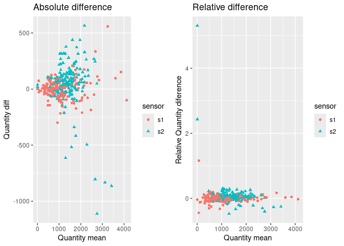
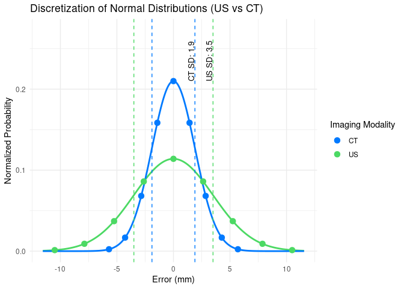
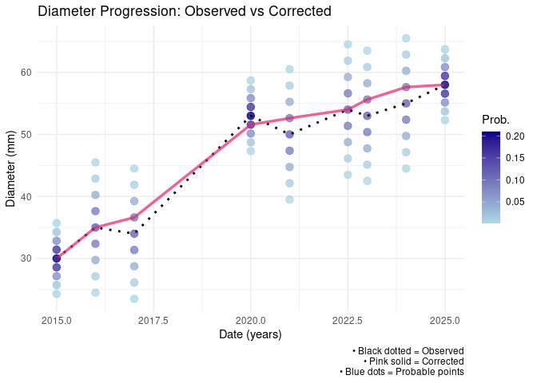
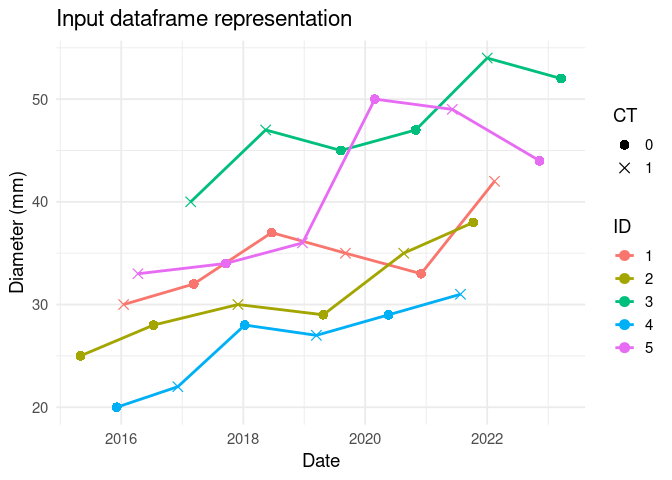
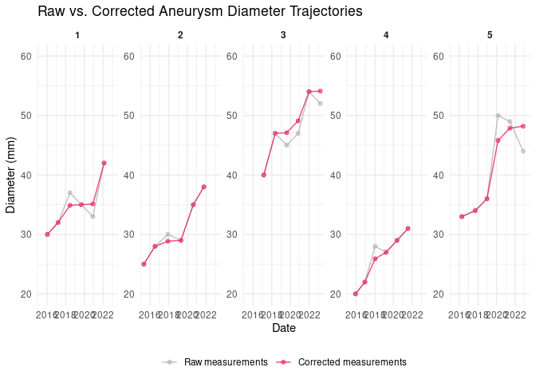
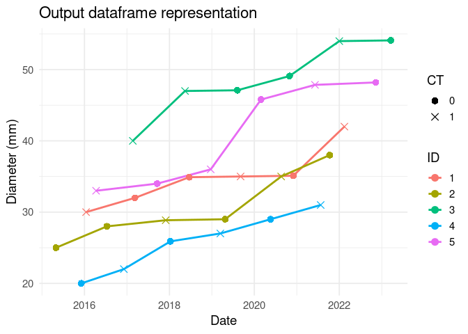
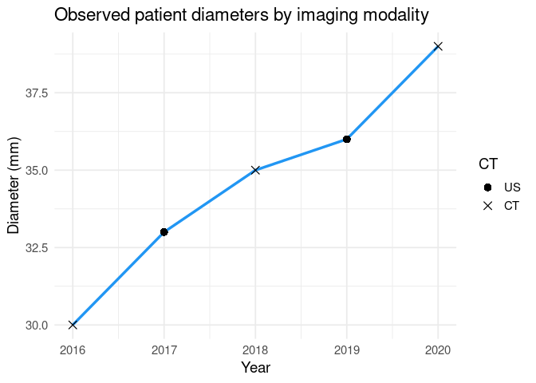
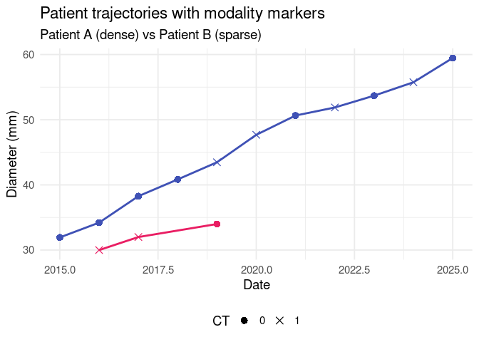
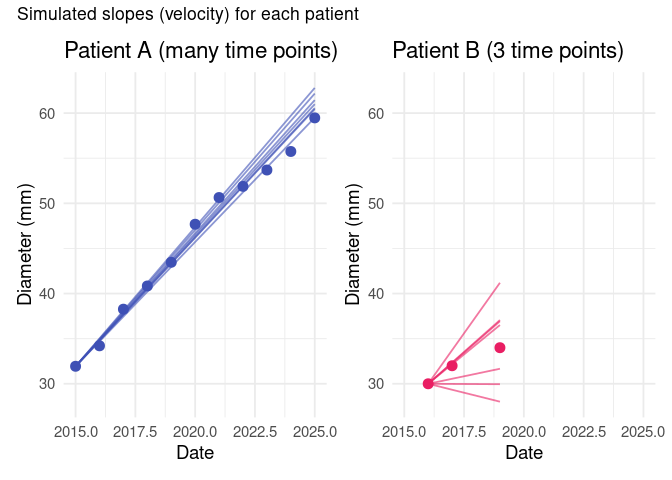
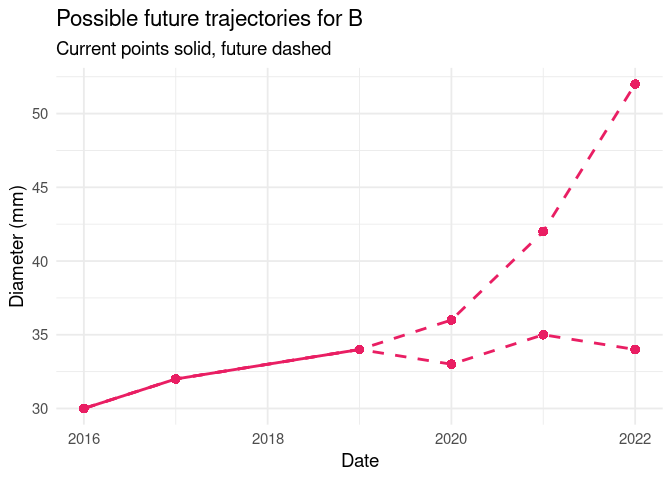

\[EU\] R-ko pakete hau nire doktoretzako proiektuan erabiliko ditudan
funtzioak gordetzeko sortua da. Proiektu honek irudietatik ateratako
ezaugarriak zientzia omikoekin (genomika, trankriptomika, proteomika
etab.) aztertzea du helburu, hortik ImgOMIC izena.

\[EN\] This package was created to compile the necessary functions for
analyzing medical imaging phenotypes alongside OMIC data. It provides
functions for the complete analysis workflow, from data preprocessing to
building associative models.

## Precision Calculation

In most cases, when working with microarrays for the quantification of
miRNA, RNA, or protein presence, duplicates are used. These duplicates
help reduce measurement variability by averaging the two results.
Additionally, they allow for quantifying variability and determining the
precision of the measuring equipment. Measuring precision is crucial to
understanding the variability of measurements, ensuring that the
associations we identify are robust and reliable.

### Measure precision

This function is based on the 2009 article [*“Estimating Precision Using
Duplicate Measurements”* by **Nicole Pauly Hyslop and Warren H.
White**](https://www.tandfonline.com/doi/abs/10.3155/1047-3289.59.9.1032).

The function’s goal is to quantify the precision of each “sensor” used
to detect the presence of a given particle. For instance, in miRNA
detection using qPCR in a microarray, the “sensor” corresponds to the
different miRNAs. Even if the same sample is introduced into every well,
each well emits fluorescent light based on the presence of a specific
miRNA, as the “sensor mechanisms” (e.g., stem-loop primers) differ for
each miRNA. The measurement variability for each miRNA can differ, but
this variability is assessable using duplicates.

The `measure_precision()` function computes precision using the Root
Mean Square (RMS) and Mean Absolute Difference (MAD). The equations used
are as follows:

$$
D\_1 = \frac{(C\_{i1}-C\_{i2})/\sqrt{2}}{\bar{C\_{i}}}
$$

$$
\text{RMS Precision} = \sqrt{\frac{1}{n}\sum\_{i = 1}^{n}D\_i^2}\times100\\
$$

$$
\text{MAD Precision} = \sqrt{\frac{\pi}{2}}\frac{1}{n}\sum\_{i = 1}^{n}|D\_i|\times100\\
$$

The function calculates precision as relative values because, in most
microarray or similar techniques, the absolute error is proportional to
the particle’s absolute presence. For this reason, results are expressed
as percentages (%).

#### Example:

The input dataset should have the following structure:

A dataframe with columns: `ID` (unique ID for each duplicate sample),
`sensor` (type of sensor), and `measurements` (measurement results). The
structure is illustrated below:

    # Load the testing data
    df_test <- read.table("../README_data/Tutorial_table.csv", header = TRUE, sep = ",")

    knitr::kable(head(df_test))

<table>
<thead>
<tr class="header">
<th style="text-align: left;">ID</th>
<th style="text-align: left;">sensor</th>
<th style="text-align: right;">measurement</th>
</tr>
</thead>
<tbody>
<tr class="odd">
<td style="text-align: left;">id0001</td>
<td style="text-align: left;">s1</td>
<td style="text-align: right;">605.1889</td>
</tr>
<tr class="even">
<td style="text-align: left;">id0001</td>
<td style="text-align: left;">s2</td>
<td style="text-align: right;">1205.2706</td>
</tr>
<tr class="odd">
<td style="text-align: left;">id0001</td>
<td style="text-align: left;">s1</td>
<td style="text-align: right;">698.7570</td>
</tr>
<tr class="even">
<td style="text-align: left;">id0001</td>
<td style="text-align: left;">s2</td>
<td style="text-align: right;">1938.3146</td>
</tr>
<tr class="odd">
<td style="text-align: left;">id0002</td>
<td style="text-align: left;">s1</td>
<td style="text-align: right;">1091.7337</td>
</tr>
<tr class="even">
<td style="text-align: left;">id0002</td>
<td style="text-align: left;">s2</td>
<td style="text-align: right;">1965.2848</td>
</tr>
</tbody>
</table>

Once the data is properly loaded, the function can be applied. By
default, it generates graphical outputs (in the case we don’t wnat them
`img`= FALSE):

    tb_output <- ImgOMIC::measure_precision(df_test)

    ## 
    ## Adjuntando el paquete: 'dplyr'

    ## The following objects are masked from 'package:stats':
    ## 
    ##     filter, lag

    ## The following objects are masked from 'package:base':
    ## 
    ##     intersect, setdiff, setequal, union

These plots display the absolute differences between duplicates for each
sensor or particle type. They help analyze the distribution of
measurement variability and better understand precision values.

    library(dplyr)
    colnames(tb_output)

    ## [1] "sensor"      "data"        "RMS"         "MAD"         "n_precision"

The output table includes the following columns: sensor, data, RMS, MAD
and n\_precision.

    knitr::kable(tb_output%>%dplyr::select(-data))

<table>
<thead>
<tr class="header">
<th style="text-align: left;">sensor</th>
<th style="text-align: left;">RMS</th>
<th style="text-align: left;">MAD</th>
<th style="text-align: left;">n_precision</th>
</tr>
</thead>
<tbody>
<tr class="odd">
<td style="text-align: left;">s1</td>
<td style="text-align: left;">13.17854</td>
<td style="text-align: left;">9.408085</td>
<td style="text-align: left;">156</td>
</tr>
<tr class="even">
<td style="text-align: left;">s2</td>
<td style="text-align: left;">48.51584</td>
<td style="text-align: left;">18.3712</td>
<td style="text-align: left;">156</td>
</tr>
</tbody>
</table>

The `RMS` and `MAD` columns represent the precision of each sensor,
calculated using different techniques. Both values are expressed as
percentages (%) and represent the variability or uncertainty of a single
measurement. For example, sensor s1 has a precision of 9-13%, meaning
that any measurement with this sensor will likely have a real value
within ±13% of the measured value. Lower values indicate better
precision.

The function calculates two types of precision due to their differing
sensitivity to input data characteristics. Depending on the use case,
one might prefer one method over the other:

-   RMS Precision is more sensitive to outliers (e.g., as seen with
    sensor s2) and is useful when penalizing outliers is important.
-   MAD Precision is less sensitive to outliers, making it a better
    representation of overall data behavior in most cases.

The `n_precision` column indicates the number of samples used to compute
the precision. Finally, the `data` column contains a tibble with the
measurements used for calculating precision values for each case:

    knitr::kable(head(tb_output$data[[1]]))

<table>
<thead>
<tr class="header">
<th style="text-align: left;">ID</th>
<th style="text-align: right;">diff</th>
<th style="text-align: right;">mn</th>
<th style="text-align: right;">n</th>
</tr>
</thead>
<tbody>
<tr class="odd">
<td style="text-align: left;">id0001</td>
<td style="text-align: right;">-66.162640</td>
<td style="text-align: right;">651.9729</td>
<td style="text-align: right;">2</td>
</tr>
<tr class="even">
<td style="text-align: left;">id0002</td>
<td style="text-align: right;">-213.412060</td>
<td style="text-align: right;">1242.6388</td>
<td style="text-align: right;">2</td>
</tr>
<tr class="odd">
<td style="text-align: left;">id0003</td>
<td style="text-align: right;">-52.712538</td>
<td style="text-align: right;">491.6770</td>
<td style="text-align: right;">2</td>
</tr>
<tr class="even">
<td style="text-align: left;">id0004</td>
<td style="text-align: right;">-16.213205</td>
<td style="text-align: right;">145.1631</td>
<td style="text-align: right;">2</td>
</tr>
<tr class="odd">
<td style="text-align: left;">id0005</td>
<td style="text-align: right;">3.114269</td>
<td style="text-align: right;">324.1417</td>
<td style="text-align: right;">2</td>
</tr>
<tr class="even">
<td style="text-align: left;">id0006</td>
<td style="text-align: right;">36.353254</td>
<td style="text-align: right;">1394.6837</td>
<td style="text-align: right;">2</td>
</tr>
</tbody>
</table>

Each of the rows of `data` dataset represent one sample. The `diff`
value represent the difference between the sample duplicates, ̀`mn`
column determines the average value between the duplicates, and the `n`
column the number of copies that have been use to calculate the values
(2 in the case of duplicates, 3 in the case of triplicates etc.)

### Error propagation

The error propagation function complements the previous precision
calculation function. In some cases, the final value used in the
analysis is derived from a combination of measurements obtained from
different sensors. The `error_propagation` function calculates both the
final value and its associated error based on the provided precision
values.

The error propagation is computed using the following formula:

$$\epsilon\_{f\_{norm}} = \sqrt{\sum\_{i = 1}^{n}\left( \frac{\partial f}{\partial s\_{i}} \cdot \epsilon\_{s\_{i}} \right)^2}$$

Here, the influence of each sensor measurement on the final result is
determined by calculating the partial derivative of the normalization
formula with respect to that specific sensor. This helps us assess how a
unitary change in a variable would impact the final result. Each partial
derivative is then multiplied by the error value of that measurement.
The overall error is derived from the Euclidean norm of these
independent contributions, calculated as the root of the sum of squares
of individual error contributions.

#### Example:

For this function, it is necessary to define:

-   The expression used to calculate the final measure (`fun`), and
-   The table containing the data used for the calculation (`tb`).

For example, suppose the desired final measure is computed using the
following equation:

$$
f\_{norm} = \frac{s\_{1}}{s\_{2}}
$$

In this case, `fun`should be defined as follows:

    fun <- expression(s1/s2)

It is important to ensure that the variable names in the function match
the `sensor` names in the input table.

For the data table, we can use the output from the `measure_precision`
function, with one modification: renaming the desired precision column
(`RMS` or `MAD`) to `err`. For instance:

    tb_input <- tb_output 
    tb_input$err <- tb_input$MAD

Here, we assign the `MAD` precision values to the `err` column. Once
this is done, the function can be applied:

    norm_val <- ImgOMIC::error_propagation(tb_input, fun)

    knitr::kable(head(norm_val))

<table>
<thead>
<tr class="header">
<th style="text-align: left;">ID</th>
<th style="text-align: right;">measure</th>
<th style="text-align: right;">error</th>
</tr>
</thead>
<tbody>
<tr class="odd">
<td style="text-align: left;">id0001</td>
<td style="text-align: right;">0.4147958</td>
<td style="text-align: right;">0.0605384</td>
</tr>
<tr class="even">
<td style="text-align: left;">id0002</td>
<td style="text-align: right;">0.4516146</td>
<td style="text-align: right;">0.0659120</td>
</tr>
<tr class="odd">
<td style="text-align: left;">id0003</td>
<td style="text-align: right;">0.1845108</td>
<td style="text-align: right;">0.0269289</td>
</tr>
<tr class="even">
<td style="text-align: left;">id0004</td>
<td style="text-align: right;">0.0465486</td>
<td style="text-align: right;">0.0067936</td>
</tr>
<tr class="odd">
<td style="text-align: left;">id0005</td>
<td style="text-align: right;">0.1911617</td>
<td style="text-align: right;">0.0278996</td>
</tr>
<tr class="even">
<td style="text-align: left;">id0006</td>
<td style="text-align: right;">0.6113048</td>
<td style="text-align: right;">0.0892184</td>
</tr>
</tbody>
</table>

The output is a dataframe containing two columns:

-   `measure`: The desired measurement value, calculated from the
    defined expression.
-   `error`: The absolute value of the propagated error associated with
    the `measure` value.

## Diameter correction

The **maximum transverse diameter** is currently the gold standard for
monitoring **abdominal aortic aneurysms (AAA)** and other types of
aneurysms. Consequently, this measurement is commonly used to assess
aneurysm growth over time. However, the maximum diameter is subject to
**inherent measurement errors** that vary depending on the imaging
technique; typically **Ultrasound (US)** or **CT scans**.

These technical inaccuracies can produce **implausible growth
patterns**, such as sudden jumps or decreases in aneurysm size, which
are not physiologically realistic. Such anomalies significantly hinder
accurate growth assessments and may bias research outcomes.

To address this, we have developed a set of R functions that **correct
diameter measurements** by accounting for **modality-specific
measurement errors**. Leveraging a probabilistic model and a dynamic
programming approach, the functions transform noisy longitudinal data
into realistic, monotonically increasing growth trajectories. The tools
support both **single-patient** and **multi-patient** datasets and are
ideal for use in clinical research or modeling applications where
precise aneurysm progression estimates are critical.

By default, the functions use standard deviation values for US and CT
derived from AAA-specific studies. These defaults can be adjusted to
accommodate research involving other types of aneurysms:

-   CT standard deviation: [J.J Wever et al., AJR,
    2012](https://ajronline.org/doi/10.2214/ajr.175.5.1751279?utm_source=chatgpt.com)
-   US standard deviation: [Q. M. Ghulam et al., ESVS,
    2017](https://pubmed.ncbi.nlm.nih.gov/28765014/)

### Correct diameters for a single Patient

#### Function Overview

The function `correct_diameter_single()` corrects diameter values for a
single patient. The input data include the diameter progression over
time and the type of imaging technique, which is specified in the `CT`
column.

The columns of the input dataset are described in the following table:

<table>
<caption>Input dataset columns</caption>
<thead>
<tr class="header">
<th style="text-align: left;">Column</th>
<th style="text-align: left;">Description</th>
<th style="text-align: left;">Values</th>
</tr>
</thead>
<tbody>
<tr class="odd">
<td style="text-align: left;">Date</td>
<td style="text-align: left;">Date of the measurement</td>
<td style="text-align: left;">Numeric Year. E.j. 2023.5</td>
</tr>
<tr class="even">
<td style="text-align: left;">Diameter</td>
<td style="text-align: left;">Measured aortic diameter</td>
<td style="text-align: left;">Numeric (mm)</td>
</tr>
<tr class="odd">
<td style="text-align: left;">CT</td>
<td style="text-align: left;">Imaging modality</td>
<td style="text-align: left;">1 = CT; 0 = US</td>
</tr>
</tbody>
</table>

Input dataset columns

In addition to this dataframe, the function also requires the definition
of two parameters: `dlim_sup` and `dlim_inf`. These represent the upper
and lower bounds of diameter change over time that are considered
realistic. For example, since we know that abdominal aortic aneurysms
(AAA) tend to grow rather than shrink, we might consider a negative
change impossible. Similarly, we might assume that a growth of more than
30 mm per year is not plausible. In this case, we would set
`dlim_inf = 0` and `dlim_sup = 30`.

#### Measurement Precision

The core idea of the function is to treat each diameter measurement not
as a single fixed value, but as a probability distribution that reflects
measurement uncertainty. This distribution is modeled as a normal
distribution centered at the measured value, with a standard deviation
determined by the imaging modality.

This distribution is discretized into a number of points (defined by the
variable `sp`) to approximate the uncertainty.

#### Curve Correction Logic

The function `correct_diameter_single` builds a list of all possible
diameter values over time based on the discretized distributions. Then,
using a Viterbi-like algorithm, it finds the most probable predecessor
diameter for each point in the time series. Only transitions within the
limits defined by `dlim_inf` and `dlim_sup` are considered valid.

Once the most probable predecessors are found for each time point, the
algorithm **backtracks** through the list to reconstruct the curve(s)
with the highest probability of being true. If there is more than one
path with equal maximum probability, all such curves are returned.

    library(ggplot2)
    library(dplyr)
    library(tidyr)

    devtools::load_all()

    # Patient dataframe
    df_patient <- data.frame(
      ID = as.factor(c("1", "1", "1", "1", "1", "1", "1", "1", "1")),
      Date = c(2015, 2016, 2017, 2020, 2021, 2022.5, 2023, 2024, 2025),
      Diam = c(30, 35, 34, 53, 50, 54, 53, 55, 58),
      CT = as.factor(c(1, 0, 0, 1, 0, 0, 0, 0, 1))
    )

    # Correct the df_patient
    corrected_result <- ImgOMIC::correct_diameter_single(df_patient, sp = 8)

    # Select the first corrected curve (if more than one)
    corrected_curve <- corrected_result$curves[[1]]

#### Output

The output of the function is a list with the following elements:

-   `curves`: A list of diameter progressions with the most probable
    values.
-   `dates`: The original input dates, ordered in ascending time.
-   `max_prob`: The maximum probability associated with the returned
    curves.
-   `num_curves`: The number of most-probable diameter progression
    curves returned.

### Correct diameters in a longitudinal dataframe

#### Function Overview

The function `correct_diameters_all` applies the single‐patient
correction to every individual in a longitudinal dataset. It takes as
input a data frame with at least the following columns:

-   `ID` : patient identifier

-   `Date` : measurement time (either a decimal year or a Date object)

-   `Diam` : observed maximum transverse diameter (mm)

-   `CT` : imaging modality indicator (1 = CT, 0 = US)

Five tuning parameters control the correction:

-   `sdUS`, `sdCT` : measurement‐error standard deviations for US and CT

-   `sp` : number of discretization points per measurement

-   `dlim_inf` : minimum permissible diameter change per year

-   `dlim_sup` : maximum permissible diameter change per year

#### Processing Steps

    library(dplyr)
    library(ggplot2)
    library(lubridate)

    #devtools::load_all()

    # 1. Manually create raw data for 5 patients
    df_raw <- data.frame(
      ID = rep(as.character(1:5), each = 6),
      Date = as.Date(c(
        # Patient 1
        "2016-01-15", "2017-03-10", "2018-06-20", "2019-09-05", "2020-12-01", "2022-02-14",
        # Patient 2
        "2015-05-01", "2016-07-12", "2017-11-30", "2019-04-25", "2020-08-19", "2021-10-10",
        # Patient 3
        "2017-02-20", "2018-05-15", "2019-08-08", "2020-10-30", "2022-01-01", "2023-03-20",
        # Patient 4
        "2015-12-05", "2016-12-05", "2018-01-10", "2019-03-15", "2020-05-20", "2021-07-25",
        # Patient 5
        "2016-04-10", "2017-09-18", "2018-12-22", "2020-02-28", "2021-06-06", "2022-11-11"
      )),
      Diam = c(
        # P1
        30, 32, 37, 35, 33, 42,
        # P2
        25, 28, 30, 29, 35, 38,
        # P3
        40, 47, 45, 47, 54, 52,
        # P4
        20, 22, 28, 27, 29, 31,
        # P5
        33, 34, 36, 50, 49, 44
      ),
      CT = c(
        # P1
        1, 0, 0, 1, 0, 1,
        # P2
        0, 0, 1, 0, 1, 0,
        # P3
        1, 1, 0, 0, 1, 0,
        # P4
        0, 1, 0, 1, 0, 1,
        # P5
        1, 0, 1, 0, 1, 0
      )
    )

1 - **Input validation**

-   The function first checks that the input is a non‐empty data frame
    containing all required columns.

-   Any missing or `NA` values in `Date`, `Diam`, or `CT` are excluded
    from correction.

2 - **Type conversion**

-   `ID` is coerced to character to avoid factor‐level issues.

-   If `Date` is a `Date` object, it is converted to a decimal‐year
    numeric.

-   `CT` need to have only `0` and `1` values.

3 - **Per‐patient correction**

-   The data frame is split by `ID` and processed patient by patient.

-   For each patient with at least two valid measurements,
    `correct_diameter_single()` is called with the specified `sdUS`,
    `sdCT`, `sp`, `dlim_inf`, and `dlim_sup`.

-   If only one most‐probable curve is returned, it replaces the
    original diameters.

-   If multiple equally probable curves exist, their elementwise average
    is taken as the “best” corrected trajectory.

4 - **Flagging and reassembly**

-   A new logical column `corrected` is added: `TRUE` for those rows
    whose diameters were adjusted, FALSE otherwise.

-   All patient subsets are re‐combined in their original order and the
    original `Date` format is restored.

#### Output

    # 2. Apply multi‐patient correction
    df_corrected <- correct_diameters_all(
      df_raw,
      sdUS     = 3.5,
      sdCT     = 1.9,
      sp       = 10,
      dlim_inf = 0,
      dlim_sup = 30
    )

The function returns a data frame identical in structure to the input
but with two key additions:

-   `Diam`: replaced by the corrected diameters wherever a valid
    correction was performed

-   `corrected`: a logical flag indicating which rows were adjusted

This enables downstream analyses to distinguish original measurements
from model‐corrected values and to work seamlessly on large,
multi‐patient cohorts.

### Estimate measurement uncertainty by Monte Carlo simulation

#### Function Overview

The function `simulate_function_sd()` performs a **Monte Carlo
simulation** to estimate  
the uncertainty (variability) of a numeric statistic derived from
longitudinal  
diameter measurements for a *single patient*.

By incorporating modality-specific measurement error (Ultrasound
vs. CT), the  
function provides an individualized estimate of how reliable the
measurements are  
for each patient.  
This helps differentiate which patient trajectories are more uncertain
due to  
measurement noise, allowing a fairer interpretation of growth trends
and  
highlighting which measurements have a higher standard deviation (sd).

#### Required Input

A single-patient `data.frame` containing:

-   `Date` : numeric time points (e.g. decimal years or day index)  
-   `Diam` : observed maximum diameter (mm)  
-   `CT` : imaging modality indicator (`1 = CT`, `0 = US`)

#### Optional Parameters

-   `FUN` : user-defined function of the form `FUN(Date, Diam)`
    returning a single numeric scalar.  
    If `NULL`, it defaults to the **slope** of a linear regression
    (`Diam ~ Date`).

-   `sdUS`, `sdCT` : measurement-error standard deviations for
    Ultrasound and CT (default: 3.5 and 1.9).

-   `n_sim` : number of Monte Carlo simulations (default: 100).

-   `seed` : random seed for reproducibility.

-   `min_diam`, `max_diam` : physically plausible limits for simulated
    diameters (default: 15 and 150 mm).

------------------------------------------------------------------------

#### Example Workflow

    library(ggplot2)
    library(dplyr)
    # devtools::load_all()  # if running from within your package source

    # 1. Simulate longitudinal data for one patient
    df_patient <- data.frame(
      Date = c(2016, 2017, 2018, 2019, 2020),
      Diam = c(30, 33, 35, 36, 39),
      CT   = c(1, 0, 1, 0, 1)
    )

------------------------------------------------------------------------

#### Processing Steps

1.  **Input validation**

    -   Checks that the input is a valid data frame with columns `Date`,
        `Diam`, and `CT`.  
    -   Ensures `Date` and `Diam` are numeric and that `CT` contains
        only `0` or `1`.

2.  **Statistic definition (`FUN`)**

    -   If no custom function is supplied, defaults to computing the
        slope of a linear regression (`Diam ~ Date`).  
    -   User-defined functions must take **exactly two numeric vectors**
        and return **a single numeric value**.

3.  **Monte Carlo simulation**

    -   For each iteration, new diameters are sampled from normal
        distributions centered on the observed values,  
        with standard deviations determined by imaging modality (`sdUS`
        or `sdCT`).  
    -   Simulated diameters are truncated within the range
        `[min_diam, max_diam]`.  
    -   The chosen statistic is recalculated for each simulated dataset.

4.  **Result aggregation**

    -   Simulations producing invalid or non-finite results are
        discarded.  
    -   Warnings are issued if any simulation fails.  
    -   The function returns the mean and standard deviation of valid
        simulations.

------------------------------------------------------------------------

#### Example Outputs

    # 3. Run simulation with default slope-based statistic
    res_default <- simulate_function_sd(df_patient, n_sim = 1000, seed = 42)
    res_default

    ## $mean
    ## [1] 2.093607
    ## 
    ## $sd
    ## [1] 0.7244625
    ## 
    ## $n_valid
    ## [1] 1000

    # 4. Custom statistic: mean diameter
    res_mean <- simulate_function_sd(df_patient, FUN = function(d, x) mean(x),
                                     n_sim = 1000, seed = 42)
    res_mean

    ## $mean
    ## [1] 34.56282
    ## 
    ## $sd
    ## [1] 1.211287
    ## 
    ## $n_valid
    ## [1] 1000

------------------------------------------------------------------------

#### Interpretation

The next visualization panels illustrate how patient-specific
measurement reliability can differ dramatically depending on the number
of observations and the imaging modalities used.

This plot shows the actual measured diameters over time for two
patients:  
- Patient A (blue) has a dense series of measurements, providing a
smooth and relatively reliable trajectory.  
- Patient B (pink) has only 3 measurements, making the observed trend
more uncertain.  
The type of measurement (Ultrasound vs. CT) is indicated by points,
which already hints at differences in measurement precision.

Each line represents a possible slope (growth rate) taking into account
the variability of diameter measures taken from CT and US.

-   For Patient A, the slopes are tightly clustered, reflecting that a
    higher number of measurements and mixed modalities lead to a smaller
    variability in estimated growth rates.  
-   For Patient B, the slopes vary considerably, demonstrating that
    fewer time points produce greater uncertainty in the estimated
    slope.

In the case of patient B there are no enough time points to trully now
how its evolution would be:

These plots collectively illustrate the **importance of incorporating
measurement variability (sd) into analyses**:

1.  **Unequal reliability across patients**  
    Not all patients’ data carry the same weight. Patients with many
    precise measurements (small sd) provide more reliable estimates of
    growth, while patients with less measurements (large sd) contribute
    less certain information.

2.  **Weighting by standard deviation**  
    When performing downstream analyses — e.g., combining growth
    estimates across patients — it is crucial to **weight each patient’s
    contribution by the inverse of their sd**.  
    Ignoring these differences would treat all patients equally,
    potentially biasing results due to patients with sparse or
    unreliable data.

3.  **Quantifying uncertainty for decision making**  
    The second plot makes it visually apparent how much the estimated
    slope can vary due to measurement noise.  
    By computing the standard deviation of these simulations,
    researchers can take the variability into account in order to train
    **higher quality predictive models**, taking into account the
    confidence in each patient’s growth estimate.

**In summary:** This example clearly demonstrates that the number of
measurements and measurement modality affect the precision of estimated
patient trajectories. Using `simulate_function_sd()` to compute
patient-specific standard deviations allows downstream analyses to
properly account for these differences, ensuring that **more reliable
measurements are appropriately weighted**, and that patients with fewer
or noisier measurements do not disproportionately influence the results.
